# Research
# Some Recent Publications

  

    <b>Title:</b> Optimum control strategies for maximum thrust production in underwater undulatory swimming 
    <b>Authors:</b> Li Fu, Sardor Israilov, Jesús Sánchez-Rodríguez, Christophe Brouzet, Guillaume Allibert, Christophe Raufaste, Médéric Argentina 
    <b>Reference:</b> Phys. Rev. Fluids, 10:(4) (2025)  
        <b>Link:</b> <a href="https://journals.aps.org/prfluids/abstract/10.1103/PhysRevFluids.10.043101">doi.org/10.1103/PhysRevFluids.10.043101</a>  
    <b>Abstract:</b> Fishes, cetaceans, and many other aquatic vertebrates undulate their bodies to propel themselves through water. Swimming requires an intricate interplay between sensing the environment, making decisions, controlling internal dynamics, and moving the body in interaction with the external medium. Within this sequence of actions initiating locomotion, biological and physical laws manifest complex and nonlinear effects, which do not prevent natural swimmers from demonstrating efficient movement. This raises two complementary questions: how to model this intricacy and how to abstract it for practical swimming. In the context of robotics, the second question is of paramount importance to building efficient artificial swimmers driven by digital signals and mechanics. In this study, we tackle these two questions by leveraging a biomimetic robotic swimmer as a platform for investigating optimal control strategies for thrust generation. Through a combination of machine learning techniques and intuitive models, we identify a control signal that maximizes thrust production. Optimum tail-beat frequency and amplitude result from the subtle interplay between the swimmer's internal dynamics and its interaction with the surrounding fluid. We then propose a practical implementation for autonomous robotic swimmers that requires no prior knowledge of systems or equations. Direct fluid-structure simulations confirm the effectiveness and reliability of the proposed approach. Hence, our findings bridge fluid dynamics, robotics, and biology, providing valuable insights into the physics of aquatic locomotion.
  

  

    
  

  

    <b>Title:</b> Undulatory underwater swimming: Linking vortex dynamics, thrust, and wake structure with a biorobotic fish 
    <b>Authors:</b> Christophe Brouzet, Christophe Raufaste, Médéric Argentina 
    <b>Reference:</b> J. Fluid. Mech (2025)  
        <b>Link:</b> <a href="https://journals.aps.org/prfluids/abstract/10.1103/PhysRevFluids.10.043101">doi.org/10.1103/PhysRevFluids.10.043101</a>  
    <b>Abstract:</b> Flapping-based propulsive systems rely on fluid-structure interactions to produce thrust.
At intermediate and high Reynolds numbers, vortex formation and organization in the
wake of such systems are crucial for the generation of a propulsive force. In this work,
we experimentally investigate the wake produced by a tethered robotic fish immersed in a
water tunnel. By systematically varying the amplitude and frequency of the fish tail as well
as the free-stream speed, we are able to observe and characterize different vortex streets as
a function of the Strouhal number. The produced wakes are three-dimensional and exhibit a
classical V-shape, mainly with two oblique trains of vortex rings convecting outward. Using
two-dimensional Particle Image Velocimetry (PIV) in the mid-span plane behind the fish and
through extensive data processing of the velocity and vorticity fields, we demonstrate the
strong couplings at place between vortex dynamics, thrust production and wake structure.
We first measure the evolution of the vortex velocity with the Strouhal number, and model
it using a momentum balance equation directly related to thrust production. We then focus
on the wake structure, such as wake angle as well as vortex ring orientation, diameter and
vorticity. The wake structure is modelled in a simple geometrical framework where the vortex
ring velocity is composed of the free-stream speed and the ring self-advecting speed. This
framework is tested and validated by our experimental measurements as well as literature data
collapsing on master curves, highlighting a universal behavior dominated by the Strouhal
number. This allows us to establish a comprehensive understanding of how the wake structure
varies with this number and, thus, thrust production.
  

  

    
  

  

    <b>Title:</b> Curvature-driven transport of thin Bingham fluid layers in airway bifurcations 
    <b>Authors:</b> C. Karamaoun, H. Kumar, M. Argentina, D. Clamond, B. Mauroy 
    <b>Reference:</b> Phys. Rev. Fluids, 9:L081101 (2024) 
    <b>Link:</b> <a href="https://doi.org/10.1103/PhysRevFluids.9.L081101">doi.org/10.1103/PhysRevFluids.9.L081101</a>  
    <b>Abstract:</b> (The mucus on the bronchial wall forms a thin layer of non-Newtonian fluid, protecting the lungs by capturing inhaled pollutants. Due to the corrugation of its interface with air, this layer is subject to surface tension forces that affect its rheology. This physical system is analyzed using lubrication theory and three-dimensional simulations. We characterize the nonlinear behavior of the mucus and show that surface tension effects can displace overly thick mucus layers in airway bifurcations. This movement can disrupt the mucociliary clearance and break the homogeneity of the layer thickness.)
  

  

    
  

  

    <b>Title:</b> Scaling the tail beat frequency and swimming speed in underwater undulatory swimming 
    <b>Authors:</b> J. Sánchez-Rodríguez, C. Raufaste, M. Argentina 
    <b>Reference:</b> Nature Communications, 14:5569 (2023) 
    <b>Link:</b> <a href="https://doi.org/10.1038/s41467-023-41368-6">doi.org/10.1038/s41467-023-41368-6</a>  
    <b>Abstract:</b> (Undulatory swimming is the predominant form of locomotion in aquatic vertebrates. A myriad of animals of different species and sizes oscillate their bodies to propel themselves in aquatic environments with swimming speed scaling as the product of the animal length by the oscillation frequency. Although frequency tuning is the primary means by which a swimmer selects its speed, there is no consensus on the mechanisms involved. In this article, we propose scaling laws for undulatory swimmers that relate oscillation frequency to length by taking into account both the biological characteristics of the muscles and the interaction of the moving swimmer with its environment. Results are supported by an extensive literature review including approximately 1200 individuals of different species, sizes and swimming environments. We highlight a crossover in size around 0.5–1 m. Below this value, the frequency can be tuned between 2–20 Hz due to biological constraints and the interplay between slow and fast muscles. Above this value, the fluid-swimmer interaction must be taken into account and the frequency is inversely proportional to the length of the animal. This approach predicts a maximum swimming speed around 5–10 m.s−1 for large swimmers, consistent with the threshold to prevent bubble cavitation.)
  

  

    
  

  

    <b>Title:</b> Reinforcement learning approach to control an inverted pendulum: A general framework for educational purposes 
    <b>Authors:</b> S. Israilov, L. Fu, J. Sánchez-Rodríguez, F. Fusco, G. Allibert, C. Raufaste, M. Argentina 
    <b>Reference:</b> PLOS ONE, 18(2):e0280071 (2023) 
    <b>Link:</b> <a href="https://doi.org/10.1371/journal.pone.0280071">doi.org/10.1371/journal.pone.0280071</a>  
    <b>Abstract:</b> (Machine learning is often cited as a new paradigm in control theory, but is also often viewed as empirical and less intuitive for students than classical model-based methods. This is particularly the case for reinforcement learning, an approach that does not require any mathematical model to drive a system inside an unknown environment. This lack of intuition can be an obstacle to design experiments and implement this approach. Reversely there is a need to gain experience and intuition from experiments. In this article, we propose a general framework to reproduce successful experiments and simulations based on the inverted pendulum, a classic problem often used as a benchmark to evaluate control strategies. Two algorithms (basic Q-Learning and Deep Q-Networks (DQN)) are introduced, both in experiments and in simulation with a virtual environment, to give a comprehensive understanding of the approach and discuss its implementation on real systems. In experiments, we show that learning over a few hours is enough to control the pendulum with high accuracy. Simulations provide insights about the effect of each physical parameter and tests the feasibility and robustness of the approach.)
  

  

    
  

  

    <b>Title:</b> Three-dimensional liquid foam flow through a hopper resolved by fast X-ray microtomography 
    <b>Authors:</b> Florian Schott, Benjamin Dollet, Stéphane Santucci, Cyrille Claudet, Médéric Argentina, Christophe Raufaste, Rajmund Mokso 
    <b>Reference:</b> Applied Sciences, 13(3):1765 (2023) 
    <b>Link:</b> <a href="[https://doi.org/10.1371/journal.pone.0280071](https://pubs.rsc.org/en/content/articlehtml/2023/sm/d2sm01299e)">doi.org/10.1371/journal.pone.0280071</a>  
    <b>Abstract:</b> We probe the complex rheological behaviour of liquid foams flowing through a conical constriction. With fast X-ray tomographic microscopy we measure in situ the displacement and deformation of up to fifty thousand bubbles at any single time instance while varying systematically the foam liquid fraction, the bubble size and the flow direction – convergent vs. divergent. The large statistics and high spatio-temporal resolution allows to observe and quantify the deviations from a purely viscous flow. We indeed reveal an asymmetry between the convergent and divergent flows associated to the emergence of elastic stresses in the latter case, and enhanced as the liquid fraction is reduced. Such effect is related to the reorientation of the deformed bubbles flowing out of the constriction, from a prolate to an oblate shape in average, while they pass through the hopper waist.
  

  

    
  

  

    <b>Title:</b> Redistribution of translational kinetic energy: the surprises of bounces 
    <b>Authors:</b> C. D’Angelo, L. Viennot, M. Argentina, F. Celestini, C. Raufaste 
    <b>Reference:</b> Eur. J. Phys., 43(6):065702 (2022) 
    <b>Link:</b>   
    <b>Abstract:</b> The topic of collisions is introduced in university education to address the laws of conservation of momentum and energy. In particular, students are asked to classify collisions as either elastic or inelastic. They are often left with the idea that ‘macroscopic energy’ has been transformed into ‘microscopic energy’ in the case of an inelastic collision, but their understanding of the processes of redistribution of kinetic energy to other degrees of freedom, often called ‘dissipation’, is mostly very poor. The aim of this article is to see how to facilitate the understanding of these processes among university students. Firstly, the results of a questionnaire with 27 university students show that they consider mass and material as the most important determinants of the coefficient of restitution of the bounce of a ball on a solid and rigid support, while the notion of internal structure, which is however essential, is not considered. Second, a simple model contextualizes the idea of a temporal sequence of successive events in the rebound of inhomogeneous projectiles. Finally, recent results on bilayered projectiles are exploited to emphasize the non-trivial influence of the structure of a body on the restitution of its initial translational kinetic energy after rebound on a support. These different elements contribute to conceive possible teaching objectives, to propose simple experiments and to address the conditions for progress in this field
  

  

    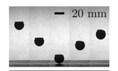
  

  

    <b>Title:</b> Intracellular pH Control by Membrane Transport in Mammalian Cells. Insights Into the Selective Advantages of Functional Redundancy 
    <b>Authors:</b> D. Doyen, M. Poët, G. Jarretou, D. F. Pisani, M. Tauc, M. Cougnon, M. Argentina, Y. Bouret, L. Counillon 
    <b>Reference:</b> Front. Mol. Biosci., 9:825028 (2022) 
    <b>Link:</b> <a href="https://doi.org/10.3389/fmolb.2022.825028">doi.org/10.3389/fmolb.2022.825028</a>  
    <b>Abstract:</b> Intracellular pH is a vital parameter that is maintained close to neutrality in all mammalian cells and tissues and acidic in most intracellular compartments. After presenting the main techniques used for intracellular an vesicular pH measurements we will briefly recall the main molecular mechanisms that affect and regulate intracellular pH. Following this we will discuss the large functional redundancy found in the transporters of H+ or acid-base equivalents. For this purpose, we will use mathematical modeling to simulate cellular response to persistent and/or transient acidification, in the presence of different transporters, single or in combination. We will also test the presence or absence of intracellular buffering. This latter section will highlight how modeling can yield fundamental insight into deep biological questions such as the utility of functional redundancy in natural selection.
  

  

    
  

  

    <b>Title:</b> Use of compliant actuators for throwing rigid projectiles 
    <b>Authors:</b> G. Giombini, J. Mathiesen, C. D’Angelo, M. Argentina, C. Raufaste, F. Celestini 
    <b>Reference:</b> Phys. Rev. E, 105:025001 (2022) 
    <b>Link:</b> <a href="https://doi.org/10.1103/PhysRevE.105.025001">doi.org/10.1103/PhysRevE.105.025001</a>  
    <b>Abstract:</b> Muscles and tendons, actuators in robotics, and various sports implements are examples that exploit elasticity to accelerate objects. Tuning the mechanical properties of elastic elements connecting objects can greatly enhance the transfer of mechanical energy between the objects. Here, we study experimentally the throw of rigid projectiles by an actuator, which has a soft elastic element added to the distal end. We vary the thickness of the elastic layer and suggest a simple mass-spring chain model to find the properties of the elastic layer, which will maximize the energy transfer from the actuator to the projectile. The insertion of a soft layer, impedance matched to the ejection frequency of the projectile mass, can increase the throwing efficiency by over 400%. Finally, we identify that very thick and very soft compliant layers could potentially lead to high efficiency and flexibility simultaneously.
  

  

    
  

  

    <b>Title:</b> Proprioceptive mechanism for bioinspired fish swimming 
    <b>Authors:</b> J. Sánchez-Rodríguez, F. Celestini, C. Raufaste, M. Argentina 
    <b>Reference:</b> Phys. Rev. Lett., 126:234501 (2021) 
    <b>Link:</b> <a href="https://doi.org/10.1103/PhysRevLett.126.234501">doi.org/10.1103/PhysRevLett.126.234501</a>  
    <b>Abstract:</b>In this Letter, we propose a mechanism for driving bioinspired fish swimming locomotion based on proprioceptive sensing. Proprioception provides information about and representation of a body’s position, motion, and acceleration in addition to the usual five senses. We hypothesize that a feedback loop based on this “sixth” sense results in an instability, driving the locomotion. In order to test our assumptions, we use a biomimetic robot and compare the experimental results to a simple yet generic model with excellent agreement.
  

  

    
  

  

    <b>Title:</b> Impact dynamics of composite elastorigid projectiles onto solid surfaces 
    <b>Authors:</b> C. D’Angelo, L. Viennot, M. Argentina, F. Celestini, C. Raufaste 
    <b>Reference:</b> Phys. Rev. E, 103:053005 (2021) 
    <b>Link:</b> <a href="https://doi.org/10.1103/PhysRevE.103.053005">doi.org/10.1103/PhysRevE.103.053005</a>  
    <b>Abstract:</b> We investigate the impact of composite objects. They consist of a soft layer on top of a rigid part with a hemispherical impacting end. The coefficient of restitution (𝑒) of such objects is studied systematically as a function of the mass ratio and of the nature of the materials. For rather elastic materials, the coefficient of restitution is a nonmonotonic function of the mass ratio and exhibits important variations. The dynamics of the impact can be characterized by several bounces depending on the ratios between the four timescales at play. These include the duration of contact of the rigid part with the substrate and the time for the elastic waves to travel back and forth in the soft layer. In that sense, describing these projectiles requires one to take into account both the Hertzian theory of contact and the elastic waves described by Saint-Venant's approach.
  

  

    
  

  

    <b>Title:</b> Study of the thrust–drag balance with a swimming robotic fish 
    <b>Authors:</b> F. Gibouin, C. Raufaste, Y. Bouret, M. Argentina 
    <b>Reference:</b> Phys. Fluids, 30:091901 (2018) 
    <b>Link:</b> <a href="https://doi.org/10.1063/1.5041784">doi.org/10.1063/1.5041784</a>  
    <b>Abstract:</b> A robotic fish is used to test the validity of a simplification made in the context of fish locomotion. With this artificial aquatic swimmer, we verify that the momentum equation results from a simple balance between a thrust and a drag that can be treated independently in the small amplitude regime. The thrust produced by the flexible robot is proportional to A2f2, where A and f are the respective tail-beat amplitude and oscillation frequency, irrespective of whether or not f coincides with the resonant frequency of the fish. The drag is proportional to 
⁠, where U0 is the swimming velocity. These three physical quantities set the value of the Strouhal number in this regime. For larger amplitudes, we found that the drag coefficient is not constant but increases quadratically with the fin amplitude. As a consequence, the achieved locomotion velocity decreases, or the Strouhal number increases, as a function of the fin amplitude.
  

  

    
  

  

    <b>Title:</b> Drag analysis with a self-propelled flexible swimmer fish 
    <b>Authors:</b> David Gross, Yann Roux, Christophe Raufaste, Argentina Médéric 
    <b>Reference:</b> Phys. Rev. Fluids 6, 053101 (2021) 
    <b>Link:</b> <a href="https://doi.org/10.1063/1.5041784">doi.org/10.1103/PhysRevFluids.6.053101</a>  
    <b>Abstract:</b> Fish swim by undulating their body to ensure propulsion. In steady state, thrust is balanced by a total drag force, whose dominant terms depend on the Reynolds number and on the flow regime. If skin friction prevails on pressure drag in the laminar regime, and conversely in the turbulent regime, it is not clear how important is the contribution of the vortex-induced drag in both regimes. In this article, we tackle both flow regimes within the same numerical framework to address this question and the relevant scaling laws at play. In particular, we show in the turbulent regime that the combination of both the pressure and vortex-induced drags sets the Strouhal number between 0.2 and 0.4 following the thrust and drag balance, in very good agreement with natural swimmers. In the laminar regime, the vortex-induced drag can be neglected in most cases. If not, we rationalize the correction and show that our two-dimensional swimmer needs to account for a significant amplification of the drag force to match the biological data.
  

  

    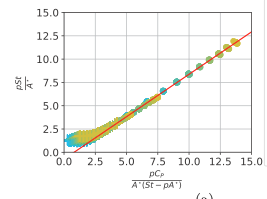
  

  

    <b>Title:</b> Contact Layer as a Propelling Advantage in Throwing
 
    <b>Authors:</b> F Celestini, J. Mathiesen, M. Argentina, C. Raufaste 
    <b>Reference:</b> Phys. Rev. Applied 14, 044026 (2020) 
    <b>Link:</b> <a href="https://doi.org/10.1063/1.5041784">doi.org/10.1103/PhysRevFluids.6.053101</a>  
    <b>Abstract:</b>The ability to throw objects is important to hominid evolution and has been central to many technological innovations in human history. The conditions for optimal throwing performance, however, are in general unknown. Here we present ejection experiments of projectiles composed of a rigid and a soft layer. The optimal performance is achieved when the soft layer of the projectiles matches the acceleration dynamics of the throwing engine. Compared with a fully rigid projectile, a bilayered projectile with a small soft elastic layer can achieve a more than 300% increase in translational kinetic energy. Our study emphasizes the importance of not only designing projectiles to optimize the stability in flight, the aerodynamic profile, and the spin, but also to carefully match the mechanical impedance of the projectiles and their thrower.
  

  

    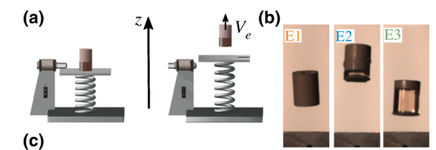
  

 

  

    <b>Title:</b> A minimal model of self-propelled locomotion
 
    <b>Authors:</b> Jesús Sánchez-Rodríguez, Christophe Raufaste, Médéric Argentina 
    <b>Reference:</b> Journal of Fluids and Structures, 97:103071 (2020). 
    <b>Link:</b> <a href="https://doi.org/10.1063/1.5041784">doi.org/10.1063/1.5041784</a>  
    <b>Abstract:</b>Fish locomotion is a complicated problem in the context of fluid–structure interaction and it is still not understood what is linked to biology and what is linked to mechanics. Measurements performed on natural fish and artificial systems reveal that swimming at high Reynolds number is found in a narrow range of Strouhal numbers - a dimensionless combination of the swimming velocity, tail beat amplitude and frequency. With a minimal model of aquatic locomotion, we investigate how this number depends on the numerous parameters at play. We show a strong correlation with the drag coefficient, while the effect of the other parameters can be neglected at the first-order approximation.
  

  

    
  

  

    <b>Title:</b> Curvature-based, time delayed feedback as a means for self-propelled swimming
 
    <b>Authors:</b> David Gross Yann Roux, M.Argentina 
    <b>Reference:</b> Journal of Fluids and Structures, 86:124–134 (2019). 
    <b>Link:</b> <a href="[https://doi.org/10.1063/1.5041784]">doi.org/10.1063/1.5041784</a>  
    <b>Abstract:</b>The development of bio-inspired robotics has led to an increasing need to understand the strongly coupled fluid–structure and control problem presented by swimming. Usually, the mechanical forcing of muscles is modeled with an imposed distribution of bending moments along the swimmer’s body. A simple way to exploit this idea is to define a central pattern forcing for this active driving, but this approach is not completely satisfactory because locomotion results from the interaction of the organism and its surroundings. Gazzola et al. (2015) have proposed that a curvature-based feedback with a time delay can trigger self-propulsion for a swimmer without necessitating such a pre-defined forcing. In the present work, we implement this feedback within a numerical model. We represent the swimmer as a thin elastic beam using a finite element representation which is coupled to an unsteady boundary element method for the resolution of the fluid domain. The model is first benchmarked on a flexible foil in forced leading edge heave.
To recover previous findings, an imposed traveling bending moment wave is then used to drive the swimmer which yields peaks in the mean forward velocity when the driving frequency corresponds to the natural frequencies of the elastic structure. Delayed, curvature-based feedback is then applied to the swimmer and produces peaks in the velocity for delays that differ from the natural periods, associated to its deformations modes. Finally, a simplified model is shown to qualitatively describe the origin of the peaks observed in the feedback swimmer.
  

  

    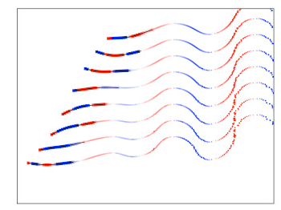
  

  

    <b>Title:</b> Study of the thrust–drag balance with a swimming robotic fish.
 
    <b>Authors:</b> Florence Gibouin, Christophe Raufaste, Yann Bouret, Médéric Argentina 
    <b>Reference:</b> Physics of Fluids, 30(9):091901 (2018). 
    <b>Link:</b> <a href="[https://doi.org/10.1063/1.5043137]">https://doi.org/10.1063/1.5043137</a>  
    <b>Abstract:</b> A robotic fish is used to test the validity of a simplification made in the context of fish locomotion. With this artificial aquatic swimmer, we verify that the momentum equation results from a simple balance between a thrust and a drag that can be treated independently in the small amplitude regime. The thrust produced by the flexible robot is proportional to A^2f^2, where A and f are the respective tail-beat amplitude and oscillation frequency, irrespective of whether or not f coincides with the resonant frequency of the fish. The drag is proportional to 
⁠rho U^2, where U is the swimming velocity. These three physical quantities set the value of the Strouhal number in this regime. For larger amplitudes, we found that the drag coefficient is not constant but increases quadratically with the fin amplitude. As a consequence, the achieved locomotion velocity decreases, or the Strouhal number increases, as a function of the fin amplitude.
  

  

    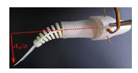
  

  

    <b>Title:</b> Equilibrium and dynamics of strained islands.
 
    <b>Authors:</b> Guido Schifani, Thomas Frisch, Médéric Argentina 
    <b>Reference:</b> Phys. Rev. E, 97:062805 (2018). 
    <b>Link:</b> <a href="[https://doi.org/10.1103/PhysRevE.97.062805]">https://doi.org/10.1103/PhysRevE.97.062805</a>  
    <b>Abstract:</b> We focus in this work on the effect of the surface energy anisotropy on an elastically strained semiconductor film and in particular on its role on the coarsening dynamics of elastically strained islands. To study the dynamics of a strained film, we establish a one-dimensional nonlinear and nonlocal partial differential equation which takes into account the elastic, capillary, wetting, and anisotropic effects. We first construct an approximate stationary solution of our model using a variational method and an appropriate ansatz. This stationary solution is used to compute the chemical potential dependence on the island height. In particular, we find that the surface energy anisotropy increases the convexity of the chemical potential and this is shown to have an effect on the driving force for the coarsening. Second, we study the coarsening dynamics of an islands pair by means of numerical simulations. We find that the presence of the surface energy anisotropy may increase or decrease the coarsening time of the system. We show that this phenomenon depends on the initial heights of island pairs. We thus highlight that the driving force for the coarsening is due to the variation of the chemical potential with respect to the islands height and that two different regimes are possible.
  

  

    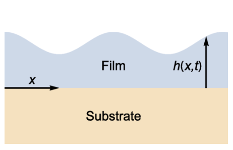
  

  

    <b>Title:</b> The fern cavitation catapult: mechanism and design principles.
 
    <b>Authors:</b> C. Llorens, M. Argentina, N. Rojas, J. Westbrook, J. Dumais, X. Noblin 
    <b>Reference:</b> J. R. Soc. Interface, 13:20150930 (2016). 
    <b>Link:</b> <a href="[https://doi.org/10.1098/rsif.2015.0930]">[https://doi.org/10.1103/PhysRevE.97.062805](https://doi.org/10.1098/rsif.2015.0930)</a>  
    <b>Abstract:</b> Leptosporangiate ferns have evolved an ingenious cavitation catapult to disperse their spores. The mechanism relies almost entirely on the annulus, a row of 12–25 cells, which successively: (i) stores energy by evaporation of the cells’ content, (ii) triggers the catapult by internal cavitation, and (iii) controls the time scales of energy release to ensure efficient spore ejection. The confluence of these three biomechanical functions within the confines of a single structure suggests a level of sophistication that goes beyond most man-made devices where specific structures or parts rarely serve more than one function. Here, we study in detail the three phases of spore ejection in the sporangia of the fern Polypodium aureum. For each of these phases, we have written the governing equations and measured the key parameters. For the opening of the sporangium, we show that the structural design of the annulus is particularly well suited to inducing bending deformations in response to osmotic volume changes. Moreover, the measured parameters for the osmoelastic design lead to a near-optimal speed of spore ejection (approx. 10 m s–1). Our analysis of the trigger mechanism by cavitation points to a critical cavitation pressure of approximately −100 ± 14 bar, a value that matches the most negative pressures recorded in the xylem of plants. Finally, using high-speed imaging, we elucidated the physics leading to the sharp separation of time scales (30 versus 5000 µs) in the closing dynamics. Our results highlight the importance of the precise tuning of the parameters without which the function of the leptosporangium as a catapult would be severely compromised.
  

  

    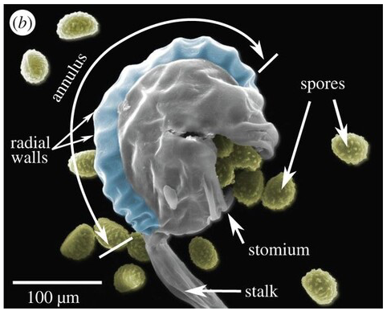
  

  

    <b>Title:</b> Bubble dynamics inside an outgassing hydrogel confined in a Hele-Shaw cell.
 
    <b>Authors:</b> Florence Haudin, Xavier Noblin, Yann Bouret, Médéric Argentina, Christophe Raufaste 
    <b>Reference:</b> Phys. Rev. E, 94:023109 (2016). 
    <b>Link:</b> <a href="[https://doi.org/10.1103/PhysRevE.94.023109]">[https://doi.org/10.1103/PhysRevE.94.023109]</a>  
    <b>Abstract:</b> We report an experimental study of bubble dynamics in a non-Newtonian fluid subjected to a pressure decrease. The fluid is a hydrogel, composed of water and a synthetic clay, prepared and sandwiched between two glass plates in a Hele-Shaw geometry. The rheological properties of the material can be tuned by the clay concentration. As the imposed pressure decreases, the gas initially dissolved in the hydrogel triggers bubble formation. Different stages of the process are observed: bubble nucleation, growth, interaction, and creation of domains by bubble contact or coalescence. Initially bubble behave independently. They are trapped and advected by the mean deformation of the hydrogel, and the bubble growth is mainly driven by the diffusion of the dissolved gas through the hydrogel and its outgassing at the reactive-advected hydrogel-bubble interface. In this regime, the rheology of the fluid does not play a significant role on the bubble growth. A model is proposed and gives a simple scaling that relates the bubble growth rate and the imposed pressure. Carbon dioxide is shown to be the gas at play, and the hydrogel is degassing at the millimeter scale as a water solution does at a smaller scale. Later, bubbles are not independent anymore. The growth rate decreases, and the morphology becomes more anisotropic as bubbles interact because they are separated by a distance smaller than the individual stress field extension. Our measurements show that the interaction distance scales with the bubbles' size.
  

  

    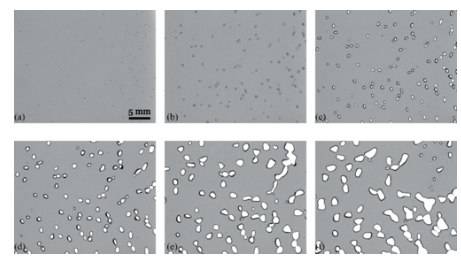
  

  

    <b>Title:</b> Solitary-like waves in a liquid foam microchannel.
 
    <b>Authors:</b> Yann Bouret, Alexandre Cohen, Nathalie Fraysse, Médéric Argentina, Christophe Raufaste 
    <b>Reference:</b> Phys. Rev. Fluids,  1:043902 (2016).
    <b>Link:</b> <a href="[https://doi.org/10.1103/PhysRevFluids.1.043902]">[https://doi.org/10.1103/PhysRevFluids.1.043902]</a>  
    <b>Abstract:</b> Plateau borders (PBs) are liquid microchannels located at the contact between three bubbles in liquid foams. They are stable, deformable, and can be thought of as quasi-one-dimensional model systems to study surface waves in fluid dynamics. We show that the burst of a bubble trapped in a PB produces local constrictions which travel along the liquid channel at constant velocity, without significant change in shape. These patterns are reminiscent of the depression solitary waves encountered in nonlinear systems. By coupling flow inertia to capillary stresses, we derive a simple model that admits solitonic solutions, which we characterized numerically and analytically in the limit of small deformation. These solutions capture most of the features observed experimentally.
  

  

    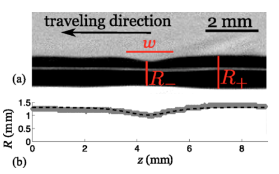
  

  

    <b>Title:</b> Shape and coarsening dynamics of strained islands.
 
    <b>Authors:</b> Guido Schifani, Thomas Frisch, Médéric Argentina, Jean-Noël Aqua 
    <b>Reference:</b> Phys. Rev. E, 94:042808 (2016).
    <b>Link:</b> <a href="https://doi.org/10.1103/PhysRevE.94.042808">https://doi.org/10.1103/PhysRevE.94.042808</a>  
    <b>Abstract:</b> We investigate the formation and the coarsening dynamics of islands in a strained epitaxial semiconductor film. These islands are commonly observed in thin films undergoing a morphological instability due to the presence of the elastocapillary effect. We first describe both analytically and numerically the formation of an equilibrium island using a two-dimensional continuous model. We have found that these equilibrium island-like solutions have a maximum height ℎ0 and they sit on top of a flat wetting layer with a thickness ℎ𝑤. We then consider two islands, and we report that they undergo a noninterrupted coarsening that follows a two stage dynamics. The first stage may be depicted by a quasistatic dynamics, where the mass transfers are proportional to the chemical potential difference of the islands. It is associated with a time scale 𝑡𝑐 that is a function of the distance 𝑑 between the islands and leads to the shrinkage of the smallest island. Once its height becomes smaller than a minimal equilibrium height ℎ*
0, its mass spreads over the entire system. Our results pave the way for a future analysis of coarsening of an assembly of islands.
  

  

    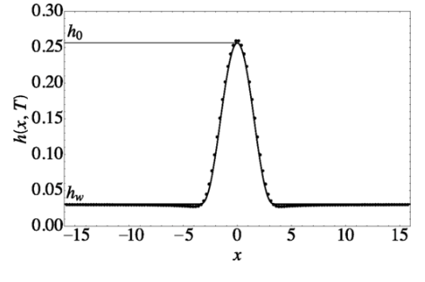
  

  

    <b>Title:</b> Gait and speed selection in slender inertial swimmers.
 
    <b>Authors:</b> Mattia Gazzola, Médéric Argentina, L. Mahadevan 
    <b>Reference:</b> PNAS, 112:3874–3879 (2015).
    <b>Link:</b> <a href="https://doi.org/10.1073/pnas.1419335112">https://doi.org/10.1073/pnas.1419335112</a>  
    <b>Abstract:</b> Swimming relies on linking internal neural dynamics to body mechanics and environmental hydrodynamics. To characterize this in an integrative setting we present a minimal theoretical framework that synthesizes the roles of passive body elasticity, hydrodynamics, muscular activation, and proprioceptive sensory feedback in inertial swimmers. Our findings quantitatively explain a range of classic experimental observations linking gait and speed in a range of swimming fish. Our calculations also yield a mechanism for how elastohydrodynamic resonances lead to optimal gait selection. Finally, we show that a self-organized propulsive gait can be achieved via a proprioceptive mechanism wherein local muscle activation is driven by shape change, without the need for a central pattern generator, suggestive of ways to engineer robotic swimmers.
  

  

    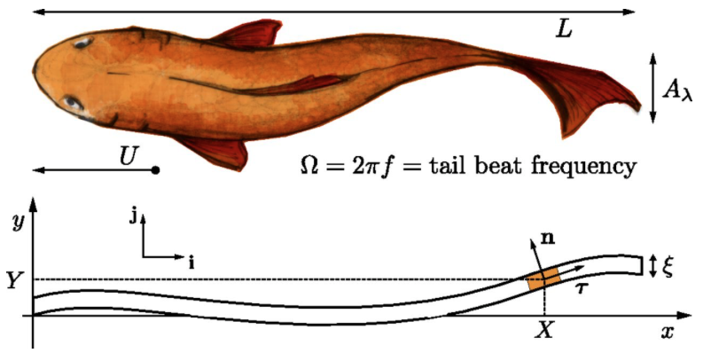
  

